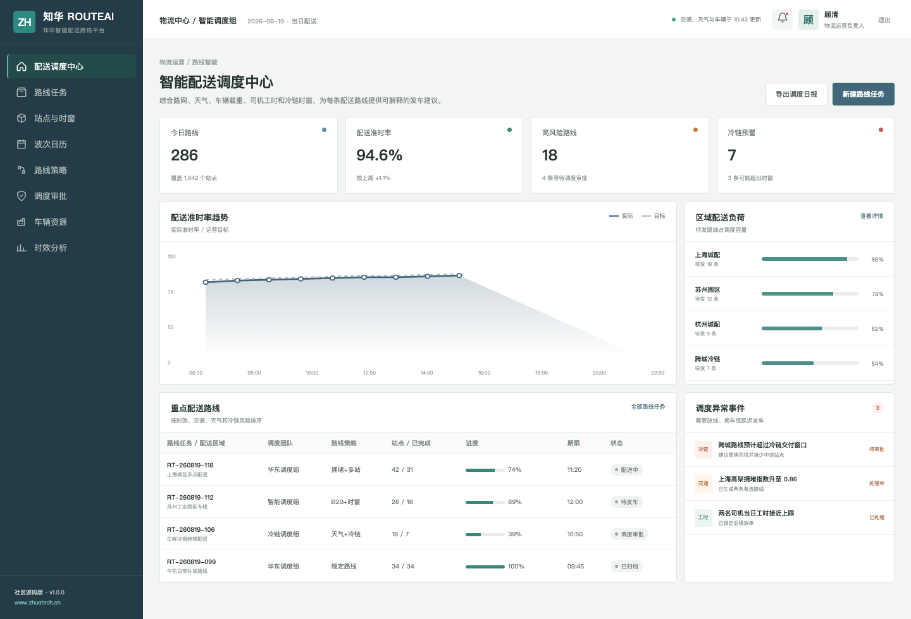
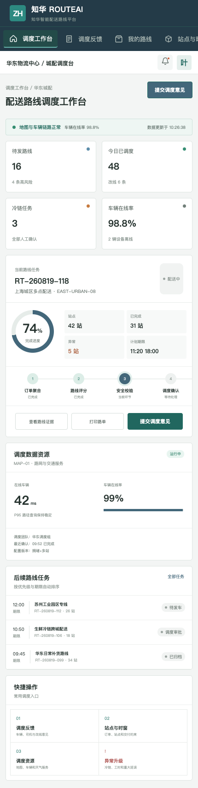

# RouteAI：智能配送路线与风险调度社区版

[知华科技](https://www.zhuatech.cn/) / 上海如静知华信息科技有限公司

RouteAI 面向城配、园区配送和冷链物流场景。系统把距离、站点数量、交通指数、天气风险、车辆载重、司机当日工时与冷链窗口放进同一套路线评估，输出预计时长、风险分、发车结论和可读的调度依据。



## 三类调度结论

1. `DISPATCH`：路线和安全约束满足要求，可由调度员确认发车。
2. `REPLAN`：拥堵、天气、载重或冷链风险较高，需要改线、换车或换司机。
3. `HOLD`：司机工时等硬门禁触发，禁止直接发车。

核心接口为 `POST /api/ai/route/plan`。结果始终保留调度审批字段；社区版完全离线可测，不依赖地图或模型 API Key。



## 功能地图

- 配送路线、站点时窗、车辆司机和波次任务
- ETA 估算、交通天气风险、司机工时与冷链门禁
- 备选路线、人工调度、异常升级与执行复盘
- 管理驾驶舱和适配移动端的调度工作台
- Spring Boot 4、Java 21、MySQL、Flyway、JWT
- Vue 3、Vite、Docker Compose、JUnit、MockMvc 与 H2

```bash
cd frontend
npm install
npm run dev:demo
```

访问 `http://localhost:5173`。管理端 `planner / Demo@2026`，调度端 `operator / Demo@2026`。演示路线、车辆、司机和客户均为虚构信息。Java 包：`cn.zhuatech.routeai`。

完整资料：[API](docs/api.md) · [架构](docs/architecture.md) · [数据库](docs/database.md) · [部署](deploy/README.md)

---

本项目仅能用于个人非商业学习交流，**不得商用**。企业部署、生产使用、SaaS、客户交付、收费服务、品牌替换或商业发行须获得上海如静知华信息科技有限公司书面授权，详见 [LICENSE](LICENSE)。

配送优化、TMS/WMS/OMS 集成、物流 AI、OPC 技术支持、FDE 与软件项目外包，请联系[知华科技](https://www.zhuatech.cn/)：

| 技术咨询 | 授权与定制 |
| --- | --- |
|  |  |

关键词：智能路径规划、配送路线优化、物流调度 AI、冷链路线、Java Vue 源码、知华科技。
